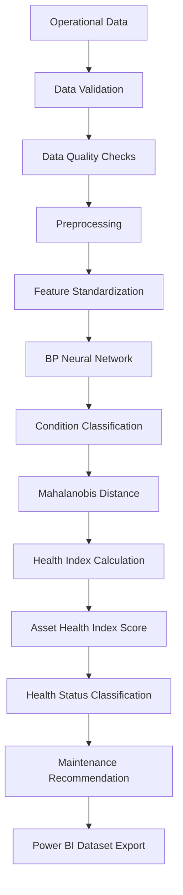
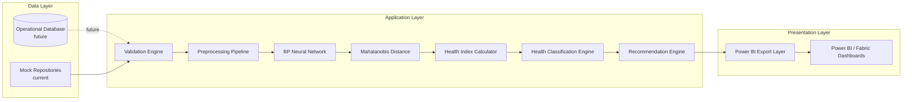

# Architecture

## Overview

The Asset Health Index (AHI) platform is organized as a modular, layered
Python application. Each stage of the Han et al. (2023) methodology is
implemented as an independent, testable module with a clear interface,
so it can be developed, tested, and later swapped (e.g., a real database
repository replacing the mock repository) without impacting other layers.

## Pipeline Architecture

## High-Level System Architecture

## Module Responsibilities

| Layer | Module | Responsibility |
|---|---|---|
| Configuration | `src/config/settings.py` | Load and validate YAML configuration into typed Pydantic settings. |
| Domain Models | `src/models/*.py` | Pydantic schemas for Asset, OperationalMeasurement, HealthAssessment, ModelMetadata. |
| Data Access | `src/repositories/*.py` | Repository interfaces (abstract) and mock (in-memory) implementations. |
| Validation | `src/validation/validator.py` | Schema, type, missing value, duplicate, and range validation with reporting. |
| Preprocessing | `src/preprocessing/preprocessor.py` | Missing value/outlier handling and `StandardScaler`-based standardization. |
| ML | `src/ml/bp_network.py` | BP Neural Network (`MLPClassifier`) condition classifier. |
| ML | `src/ml/mahalanobis.py` | Mahalanobis Distance healthy-baseline model. |
| ML | `src/ml/health_index.py` | Health Index (HI) and Asset Health Index (AHI) formulas. |
| ML | `src/ml/training_pipeline.py` | Stratified train/test split and training orchestration. |
| Rules | `src/rules/health_classification.py` | AHI score to health status classification. |
| Recommendations | `src/recommendations/recommendation_engine.py` | Health status to maintenance recommendation mapping. |
| Export | `src/exports/powerbi_export.py` | Star-schema fact/dimension table construction and CSV export. |
| Utilities | `src/utils/logger.py`, `src/utils/constants.py` | Logging setup and shared constants. |

## Design Principles

- **SOLID principles**: each module has a single responsibility and depends on
  abstractions (e.g., repository interfaces) rather than concrete implementations.
- **Configuration-driven design**: hyperparameters, thresholds, and business
  rules are externalized to `config/config.yaml`.
- **Testability**: all core algorithm classes can be constructed and unit
  tested without real data or trained models.
- **Extensibility**: the repository interface layer allows a future SQL
  database (or Microsoft Fabric Lakehouse) implementation to be introduced
  without changing calling code.

## Future Extensibility

- **Microsoft Fabric**: repositories can be re-implemented against Fabric
  Lakehouse tables; exports can target Fabric OneLake instead of local CSV.
- **Azure ML**: `training_pipeline.py` can be wrapped in an Azure ML pipeline
  job for managed training, tracking, and model registry integration.
- **Power BI Service**: exported CSVs can be replaced with a direct Power BI
  dataset push (streaming or scheduled refresh) or a Fabric semantic model.
- **Copilot Studio**: the recommendation engine outputs can be exposed as an
  API/action for conversational maintenance-assistant scenarios.
